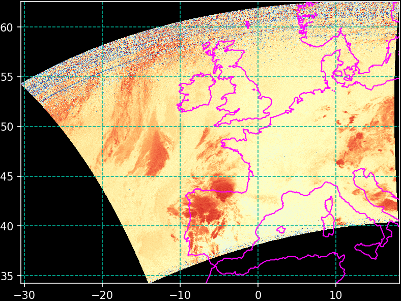

# Decoder for the Automatic Picture Transmission protocol

[](https://travis-ci.org/Alexander-Barth/APTDecoder.jl)
[](https://ci.appveyor.com/project/Alexander-Barth/aptdecoder-jl)
[](https://coveralls.io/github/Alexander-Barth/APTDecoder.jl?branch=master)
[](https://alexander-barth.github.io/APTDecoder.jl/latest/)


All you need is a (relatively inexpensive) software-defined radio and antenna for 137 MHz (following for example these [instructions](https://www.instructables.com/id/NOAA-Satellite-Signals-with-a-PVC-QFH-Antenna-and-/)) to receive data from the NOAA weather satellites NOAA 15, NOAA 18 and NOAA 19.
The data is first recorded using a software like GQRX (https://noaa-apt.mbernardi.com.ar/guide.html).


## Installation of APDDecoder.jl

* Install [julia](https://julialang.org/downloads/)
* Launch julia and run to following commands to install `APTDecoder`:

```julia
import Pkg
Pkg.develop(PackageSpec(url="https://github.com/Alexander-Barth/APTDecoder.jl"))
```

* Make plots of a decoded and georefenced data stream with the following Julia command:

```julia
import APTDecoder
APTDecoder.makeplots("gqrx_20190825_182745_137620000.wav","NOAA 15")
```
The first argument of `APTDecoder.makeplots` is the wav file which should include the date and time in UTC (which is the default for GQRX) and the name of the satellite, e.g. "NOAA 15", "NOAA 18" or "NOAA 19".

This produces the following images:


This is the raw data. Channel a is on the left and channel b on the right. Note that channel a is just switching the wave-length during the capture. In part of Europe the sun went already down.




# Alternatives

* [NOAA-APT](https://github.com/martinber/noaa-apt) with some [excellent documentation](https://noaa-apt.mbernardi.com.ar/guide.html)
* [apt-decoder](https://github.com/zacstewart/apt-decoder)
* [aptdec](https://github.com/csete/aptdec)
* [DirectDemod](https://github.com/aerospaceresearch/DirectDemod)
* [apt137](https://github.com/pietern/apt137)
* [APT3000](https://github.com/ThatcherC/APT3000)
* ...

# Credits

Many thanks to the authors of the [SatelliteToolbox.jl](https://github.com/JuliaSpace/SatelliteToolbox.jl) and the [DSP.jl](https://github.com/JuliaDSP/DSP.jl). These packages are used to predict the satellite orbit and to extract the APT signal.
